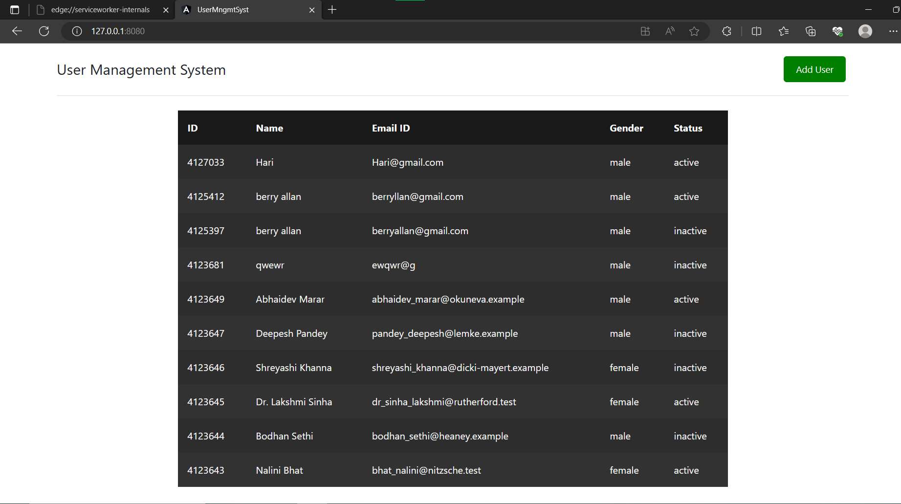
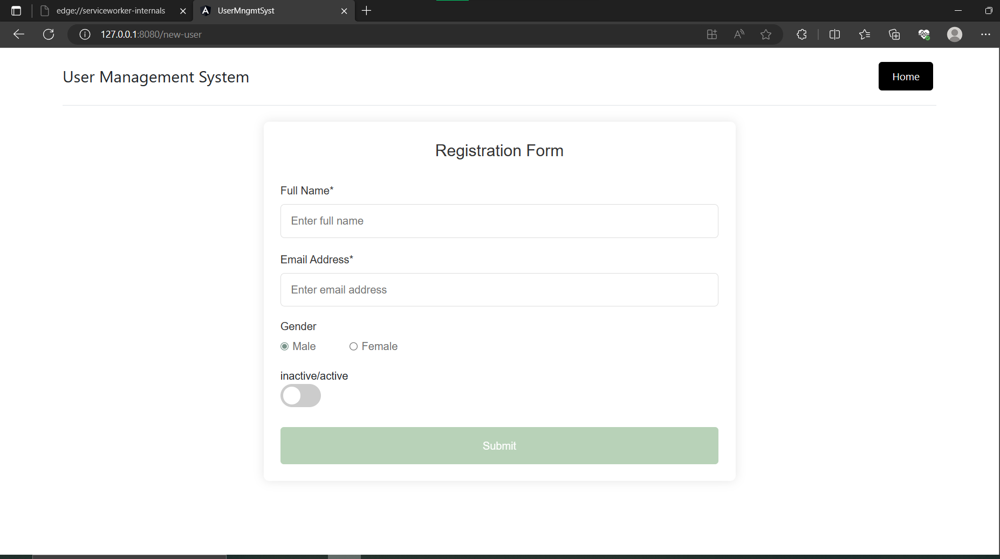

# User Management System

<!-- ## gets real
git init
git clone:
npm i
ng serve
localhost:4200 -->

<!-- now check for service worker -->
<!-- ng add @angular/pwa
ng build
cd dist/user-mngmt-syst
http-server -o
->opens up in server 8080 -->


# Introduction
- This is a simple project to register users

## :ledger: Index

- [About](#beginner-about)
<!-- - [Usage](#zap-usage) -->
  - [Installation](#electric_plug-installation)
  <!-- - [Commands](#package-commands) -->
<!-- - [Development](#wrench-development) -->
  - [Pre-Requisites](#notebook-pre-requisites)
  <!-- - [Developmen Environment](#nut_and_bolt-development-environment) -->
  <!-- - [File Structure](#file_folder-file-structure) -->
  - [Build](#hammer-build)  
  <!-- - [Deployment](#rocket-deployment)   -->
<!-- - [Community](#cherry_blossom-community) -->
  <!-- - [Contribution](#fire-contribution) -->
  <!-- - [Branches](#cactus-branches) -->
  <!-- - [Guideline](#exclamation-guideline)   -->
<!-- - [FAQ](#question-faq) -->
- [Resources](#page_facing_up-resources)
- [Gallery](#camera-gallery)
<!-- - [Credit/Acknowledgment](#star2-creditacknowledgment) -->
<!-- - [License](#lock-license) -->

##  :beginner: About
Add a detailed introduction about the project here, everything you want the reader to know.

<!-- ## :zap: Usage
One can use this project to register users.They can view users even when offline. -->

###  :electric_plug: Installation
1.Create an empty folder and initialize an empty git repo using the command "git init"
2.In terminal, navigate to the folder and type "git clone https://github.com/shernoble/User-Management-System-Angular.git"
3.Now, all the project files will be downloaded. Install the dependencies using the command "npm i"
4.Type the command to add the angular pwa package to use service workers "ng add @angular/pwa"
5.Build the app for production with the command "ng build"
6.Go to the dist folder "cd dist/user-mngmt-syst"
7.Serve with http-server "http-server -o"
8.Application opens up in server 8080.
9.In the dev tools, under Application->Service Workers, check the "Update on reload" box.
10.The project should now be fully functional.

```
$ add installations steps if you have to.
```

<!-- ###  :package: Commands
- Commands to start the project. -->

<!-- ##  :wrench: Development
If you want other people to contribute to this project, this is the section, make sure you always add this. -->

### :notebook: Pre-Requisites
- Angular CLI
- 

<!-- ###  :nut_and_bolt: Development Environment
Write about setting up the working environment for your project.
- How to download the project...
- How to install dependencies... -->


<!-- ###  :file_folder: File Structure
Add a file structure here with the basic details about files, below is an example.

```
.
├── assets
│   ├── css
│   │   ├── index-ui.css
│   │   └── rate-ui.css
│   ├── images
│   │   ├── icons
│   │   │   ├── shrink-button.png
│   │   │   └── umbrella.png
│   │   ├── logo_144.png
│   │   └── Untitled-1.psd
│   └── javascript
│       ├── index.js
│       └── rate.js
├── CNAME
├── index.html
├── rate.html
└── README.md
```

| No | File Name | Details 
|----|------------|-------|
| 1  | index | Entry point -->


##  :page_facing_up: Resources
-https://angular.io/docs
-https://www.geekstrick.com/angular-pwa-fast-offline-angular-9-application/
- 

##  :camera: Gallery
Pictures of your project.




<!-- ## :star2: Credit/Acknowledgment
Credit the authors here.

##  :lock: License
Add a license here, or a link to it. -->
